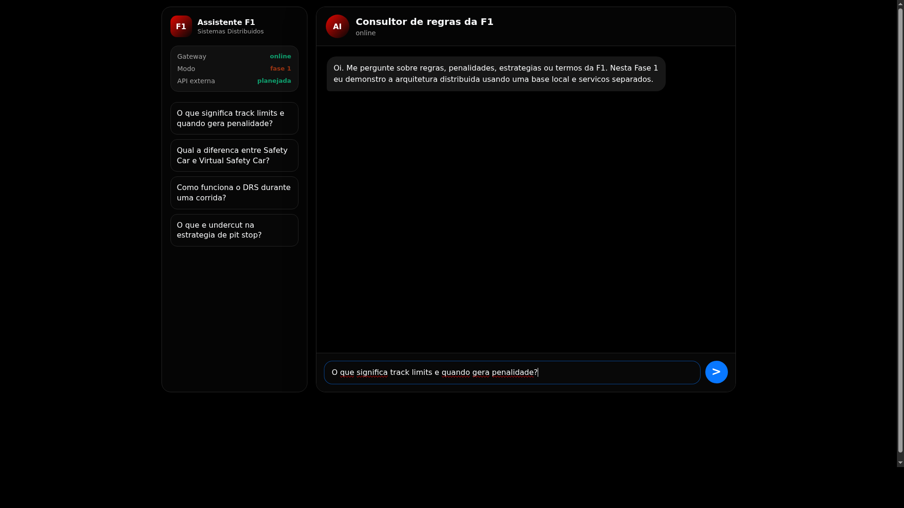

# Assistente F1 - Sistemas Distribuidos



**Legenda do print:** a lateral esquerda mostra o estado dos componentes da arquitetura; a area central e o chat usado pelo usuario; o campo inferior envia a pergunta para o Gateway, que encaminha a requisicao para os microservicos.

Entrega atual: **Fase 2: RAG + MCP + LLM**.

O projeto demonstra uma arquitetura em JavaScript/Node.js com multiplos componentes se comunicando por REST, integrando RAG (busca vetorial com documentos reais), MCP (Model Context Protocol com ferramentas externas) e LLM (Groq API). O tema e Formula 1.

## Material de referencia

- [PDF-base da arquitetura](arq_sistemas_distribuidos.pdf): esboço original usado como referencia.
- [Diagrama da arquitetura](docs/architecture.mmd): diagrama Mermaid da arquitetura Fase 2.
- [Plano de ensino](Plano%20de%20Ensino%20e%20descrção%20Trabalho%202026%201.pdf): descricao completa do trabalho pratico.

## Como rodar

```bash
npm run dev
```

Depois abra:

```text
http://localhost:3000
```

### Configurar LLM (opcional mas recomendado)

Crie um arquivo `.env` na raiz com sua chave Groq:

```bash
LLM_API_KEY=gsk_sua_chave_aqui
```

Sem a chave, o sistema funciona em modo fallback (template sem LLM).

### Configurar RapidAPI (opcional)

Para usar dados ao vivo da Formula 1 via RapidAPI, adicione ao `.env`:

```bash
RAPIDAPI_KEY=sua_chave_rapidapi
RAPIDAPI_HOST=f1-live-pulse.p.rapidapi.com
```

Sem a chave, as ferramentas MCP retornam dados de demonstracao.

## O que esta implementado na Fase 2

- **Front-end em Vue 3** no formato de chat.
- **Gateway publico** em `localhost:3000`.
- **Orchestrator** em `localhost:3001` (coordena RAG, MCP e LLM).
- **Knowledge Base Service** em `localhost:3002` com RAG real:
  - Documentos reais de regulamentos FIA em `src/data/f1-documents.json`
  - Embeddings locais com `@xenova/transformers` (all-MiniLM-L6-v2)
  - Busca vetorial por similaridade cosseno
- **External API Service** em `localhost:3003` como MCP Server:
  - Exposicao de ferramentas via Model Context Protocol
  - Ferramentas: classificacao de pilotos, classificacao de construtores, mensagens da Race Control, clima, informacoes da sessao
  - Integracao com RapidAPI F1 (com fallback para dados demo)
- **Explanation Service** em `localhost:3004` com LLM:
  - Integracao com Groq API (modelo llama-3.3-70b-versatile)
  - Prompts com contexto RAG e dados MCP
  - Fallback para template se LLM nao estiver configurado
- Comunicacao REST entre todos os servicos.
- Documentacao e diagrama de arquitetura em `docs/`.

## O que nao esta implementado agora

- Busca vetorial persistente (usa memoria).
- Modelo generativo proprio (usa API externa Groq).
- Fila/eventos assincronos.

## Microservicos

| Servico | Porta | Responsabilidade na Fase 2 |
| --- | ---: | --- |
| Gateway Service | 3000 | Serve o front e recebe `/api/ask`. |
| Orchestrator Service | 3001 | Coordena RAG, MCP e LLM. |
| Knowledge Base Service | 3002 | RAG: documentos reais + embeddings + busca vetorial. |
| External API Service | 3003 | MCP Server com ferramentas RapidAPI F1. |
| Explanation Service | 3004 | LLM (Groq) com prompts de RAG + MCP. |

**Legenda dos microservicos:** cada linha da tabela representa um processo Node separado. A separacao existe para demonstrar arquitetura distribuida, mesmo rodando tudo localmente.

## Estrutura

```text
src/
  core/            classificacao, embedder, busca vetorial, cliente LLM
  data/            documentos reais de regulamentos FIA
  mcp/             servidor MCP, cliente MCP, ferramentas F1
  services/        microservicos Node independentes
  utils/           helpers de HTTP/JSON
public/            interface de chat em Vue
docs/              arquitetura e diagrama
```

## Proximas fases

Fase 3: aprimorar MCP com invocacao dinamica pelo LLM, adicionar filas/eventos, e melhorar a qualidade do RAG com chunking avancado.
